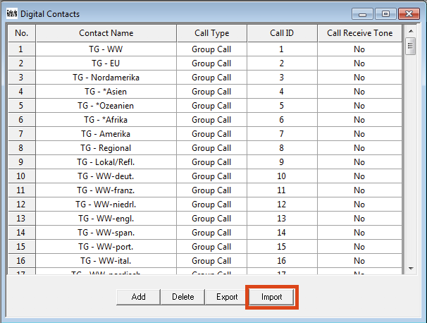

# S5 DMR

Codeplugi za S5 in nekaj drugih držav.

Ažurna datoteka S5 kontaktov in različnih TG, primerna za uvoz v CPS_DMR in N0GSG programih.

* [S5 RPT](Doc/S5-RPT.md) informacije o S5 DMR repetitorjih.
* [S5 TG](Doc/S5-TG.md) informacije o S5 pogovornih skupinah.

Vabljeni k prispevanju datotek, predlogov in popravkov.

## Uvoz kontaktov v CPS_DMR programu

POZOR: UVOZ KONTAKTOV PREPIŠE OBSTOJEČE KONTAKTE V CODEPLUG-U, PRED UVOZOM NAREDITE VARNOSTNO KOPIJO!

Preberite obstoječi "codeplug" s postaje in izberite "Contacts".

Izberite datoteko [S5-contacts-CPS_DMR.txt](CPS_DMR/S5-contacts-CPS_DMR.txt)

## Preizkušene postaje
 * Retevis RT-8

## Viri

Osnova za datoteko je pridobljena na spletni strani http://ham-dmr.si

Podatki o registriranih DMR ID številkah pridobljeni s spletne strani http://ham-digital.org

## Zanimive povezave

[http://web1.foxhollow.ca/dmr/Contacts/MD380/]

*Pred nalaganjem codeplugov nujno zamenjajte ID številko s svojo!*
